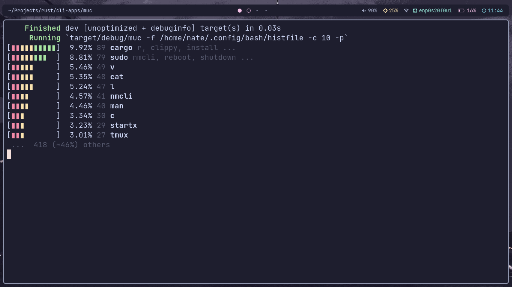

# MUC
Visualize your most used commands  



## Usage

### Installing

#### Arch users (AUR)

Use your favorite AUR helper to install [muc-git](https://aur.archlinux.org/packages/muc-git) package (or build manually using `git` and `makepkg -si`), for example: `paru -S muc-git`

#### Nix

You can use the outputs provided by the `flake.nix` inside this repository to install `muc`. Either with the `overlays.default` output for your system configuration, or the package output to imperatively install it with `nix install github:nate-sys/muc` or create an ad-hoc shell with `nix shell github:nate-sys/muc`.

To quicky run muc use following command.
```sh
nix run github:nate-sys/muc 
```

#### Other distros

```sh
cargo install --git=https://github.com/nate-sys/muc
```

### Running

muc uses your $HISTFILE environment variable to get your history
```sh
muc # Bash or Vanilla zsh
muc --shell ohmyzsh # ohmyzsh
muc --shell fish # Fish
muc --regexp <some regex> # parse the histfile yourself (this overrides shell)

muc -c 5 # show top 5 instead of the default 10

muc --bar "=,*,-,=" # change the appearance of the bar =*****-----=
``` 


### Roadmap
- [X] Colors
- [X] Customizable bar
- [ ] Resolve aliases
- [ ] Recognize leader commands (sudo, doas, git, etc)
